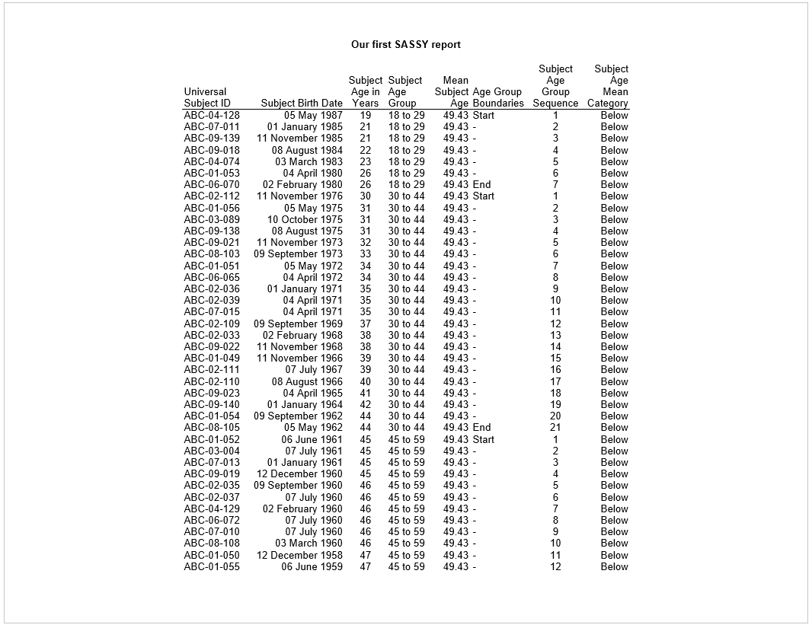
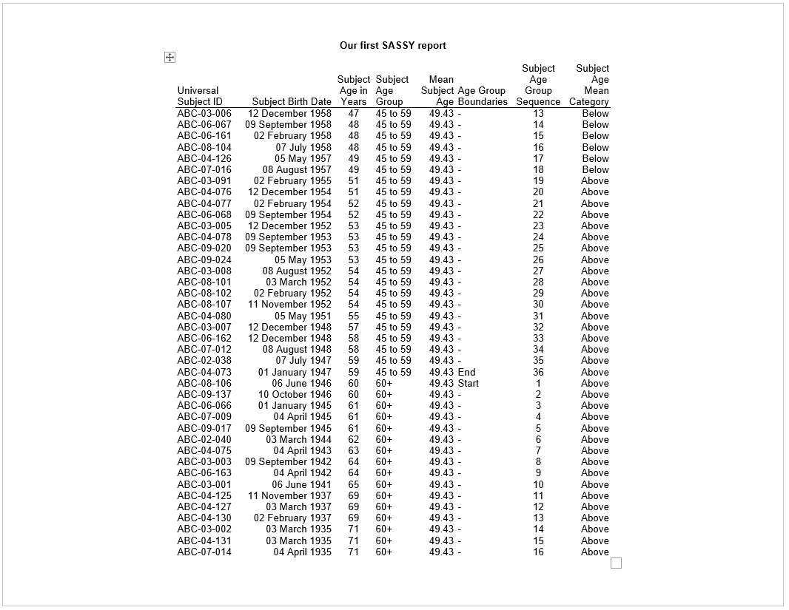
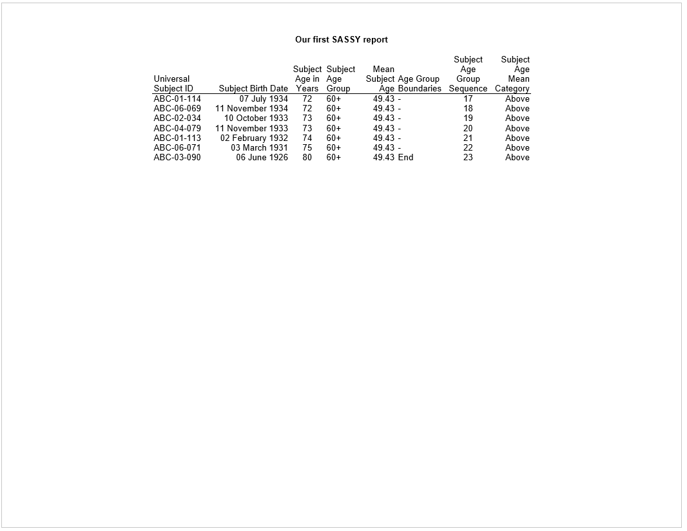

```{r setup, include = FALSE}
knitr::opts_chunk$set(
  collapse = TRUE,
  comment = "#>"
)

options(rmarkdown.html_vignette.check_title = FALSE)

```

The previous examples in the **logr** documentation were intentionally
simplified to focus on the workings of a particular function.  It is helpful,
however, to also view **logr** functions in the context of a complete 
program.  The following example shows a complete program.  The example illustrates
how **logr** functions work together, and interact with **tidyverse** and
**sassy** functions to create a comprehensive log.  

This example has been chosen
because it incorporates many of the functions that will log automatically. 
If you want to maximize the auto-generation features of **logr**, take note of
these functions.

The data for this example has been included in the **logr** package as an
external data file.  It may be accessed using the `system.file()` function
as shown below, or downloaded directly from the **logr** GitHub site 
[here](https://github.com/dbosak01/logr/inst/extdata/DM.csv)

```{r eval=FALSE, echo=TRUE}
library(tidyverse)
library(sassy)

options("logr.autolog" = TRUE)

# Get temp location for log and report output
tmp <- tempdir()

# Open the log
lf <- log_open(file.path(tmp, "example1.log"))

# Send code to the log
log_code()

sep("Load the data")

# Get path to sample data
pkg <- system.file("extdata", package = "logr")

# Define data library
libname(sdtm, pkg, "csv") 

# Load the library into memory
lib_load(sdtm)


# Prepare Data -------------------------------------------------------------
sep("Prepare the data")

# Define format for age groups
ageg <- value(condition(x > 18 & x <= 29, "18 to 29"),
              condition(x >= 30 & x <= 44, "30 to 44"),
              condition(x >= 45 & x <= 59, "45 to 59"),
              condition(TRUE, "60+"))


# Manipulate data
final <- sdtm.DM %>% 
  select(USUBJID, BRTHDTC, AGE) %>% 
  mutate(AGEG = fapply(AGE, ageg)) %>% 
  arrange(AGEG, AGE) %>% 
  group_by(AGEG) %>% 
  datastep(retain = list(SEQ = 0), 
           calculate = {AGEM <- mean(AGE)},
           attrib = list(USUBJID = dsattr(label = "Universal Subject ID"),
                         BRTHDTC = dsattr(label = "Subject Birth Date", 
                                          format = "%m %B %Y"),
                         AGE = dsattr(label = "Subject Age in Years", 
                                      justify = "center"),
                         AGEG = dsattr(label = "Subject Age Group", 
                                       justify = "left"), 
                         AGEB = dsattr(label = "Age Group Boundaries"),
                         SEQ = dsattr(label = "Subject Age Group Sequence", 
                                      justify = "center"),
                         AGEM = dsattr(label = "Mean Subject Age", 
                                       format = "%1.2f"),
                         AGEMC = dsattr(label = "Subject Age Mean Category",
                                        format = c(B = "Below", A = "Above"), 
                                        justify = "right")), 
           {
             
             # Start and end of Age Groups
             if (first. & last.)
               AGEB <- "Start - End"
             else if (first.)
               AGEB <- "Start"
             else if (last.)
               AGEB <- "End"
             else 
               AGEB <- "-"
             
             # Sequence within Age Groups
             if (first.)
               SEQ <- 1
             else 
               SEQ <- SEQ + 1
             
             # Above or Below the mean age
             if (AGE > AGEM)
               AGEMC <- "A"
             else 
               AGEMC <- "B"
             
           }) %>% 
  ungroup() %>% 
  put()

# Put dictionary to log
dictionary(final) %>% put()

# Create Report ------------------------------------------------------------
sep("Create report")


# Create table
tbl <- create_table(final)

# Create report
rpt <- create_report(file.path(tmp, "./output/example1.rtf"), 
                     output_type = "RTF", font = "Arial") %>% 
  titles("Our first SASSY report", bold = TRUE) %>% 
  add_content(tbl)

# write out the report
res <- write_report(rpt)


# Clean Up -----------------------------------------------------------------
sep("Clean Up")

# Unload libname
lib_unload(sdtm)

# Close the log
log_close()

# View log
writeLines(readLines(lf, encoding = "UTF-8"))

# View Report
# file.show(res$modified_path)


```

The above program produces the following log:
```
=========================================================================
Log Path: C:/Users/dbosa/AppData/Local/Temp/Rtmp6DW7BF/log/example1.log
Program Path: C:\packages\logr\vignettes\logr-example1.Rmd
Working Directory: C:/packages/logr
User Name: dbosa
R Version: 4.1.2 (2021-11-01)
Machine: SOCRATES x86-64
Operating System: Windows 10 x64 build 19041
Base Packages: stats graphics grDevices utils datasets methods base
Other Packages: tidylog_1.0.2 reporter_1.2.6 libr_1.2.1 fmtr_1.5.3 sassy_1.0.5
                forcats_0.5.1 stringr_1.4.0 purrr_0.3.4 readr_2.0.2 tidyr_1.1.4
                tibble_3.1.5 ggplot2_3.3.5 tidyverse_1.3.1 logr_1.2.7 dplyr_1.0.7
Log Start Time: 2021-11-16 08:40:18
=========================================================================

> library(tidyverse)
> library(sassy)
> 
> options("logr.autolog" = TRUE)
> 
> # Open the log
> lf <- log_open()
> 
> # Send code to the log
> log_code()
> 
> sep("Load the data")
> 
> # Get path to sample data
> pkg <- system.file("extdata", package = "logr")
> 
> # Define data library
> libname(sdtm, pkg, "csv") 
> 
> # Load the library into memory
> lib_load(sdtm)
> 
> 
> # Prepare Data -------------------------------------------------------------
> sep("Prepare the data")
> 
> # Define format for age groups
> ageg <- value(condition(x > 18 & x <= 29, "18 to 29"),
>               condition(x >= 30 & x <= 44, "30 to 44"),
>               condition(x >= 45 & x <= 59, "45 to 59"),
>               condition(TRUE, "60+"))
> 
> 
> # Manipulate data
> final <- sdtm.DM %>% 
>   select(USUBJID, BRTHDTC, AGE) %>% 
>   mutate(AGEG = fapply(AGE, ageg)) %>% 
>   arrange(AGEG, AGE) %>% 
>   group_by(AGEG) %>% 
>   datastep(retain = list(SEQ = 0), 
>            calculate = {AGEM <- mean(AGE)},
>            attrib = list(USUBJID = dsattr(label = "Universal Subject ID"),
>                          BRTHDTC = dsattr(label = "Subject Birth Date", 
>                                           format = "%m %B %Y"),
>                          AGE = dsattr(label = "Subject Age in Years", 
>                                       justify = "center"),
>                          AGEG = dsattr(label = "Subject Age Group", 
>                                        justify = "left"), 
>                          AGEB = dsattr(label = "Age Group Boundaries"),
>                          SEQ = dsattr(label = "Subject Age Group Sequence", 
>                                       justify = "center"),
>                          AGEM = dsattr(label = "Mean Subject Age", 
>                                        format = "%1.2f"),
>                          AGEMC = dsattr(label = "Subject Age Mean Category",
>                                         format = c(B = "Below", A = "Above"), 
>                                         justify = "right")), 
>            {
>              
>              # Start and end of Age Groups
>              if (first. & last.)
>                AGEB <- "Start - End"
>              else if (first.)
>                AGEB <- "Start"
>              else if (last.)
>                AGEB <- "End"
>              else 
>                AGEB <- "-"
>              
>              # Sequence within Age Groups
>              if (first.)
>                SEQ <- 1
>              else 
>                SEQ <- SEQ + 1
>              
>              # Above or Below the mean age
>              if (AGE > AGEM)
>                AGEMC <- "A"
>              else 
>                AGEMC <- "B"
>              
>            }) %>% 
>   ungroup() %>% 
>   put()
> 
> # Put dictionary to log
> dictionary(final) %>% put()
> 
> # Create Report ------------------------------------------------------------
> sep("Create report")
> 
> 
> # Create table
> tbl <- create_table(final)
> 
> # Create report
> rpt <- create_report("./output/example1.rtf", 
>                      output_type = "RTF", font = "Arial") %>% 
>   titles("Our first SASSY report", bold = TRUE) %>% 
>   add_content(tbl)
> 
> # write out the report
> res <- write_report(rpt)
> 
> 
> # Clean Up -----------------------------------------------------------------
> sep("Clean Up")
> 
> # Unload libname
> lib_unload(sdtm)
> 
> # Close the log
> log_close()
> 
> # View log
> writeLines(readLines(lf, encoding = "UTF-8"))
> 
> # View Report
> # file.show(res$modified_path)

=========================================================================
Load the data
=========================================================================

# library 'sdtm': 8 items
- attributes: csv not loaded
- path: C:/Users/dbosa/Documents/R/win-library/4.1/libr/extdata
- items:
  Name Extension Rows Cols     Size        LastModified
1   AE       csv  150   27  88.3 Kb 2021-10-08 15:02:15
2   DA       csv 3587   18 528.1 Kb 2021-10-08 15:02:15
3   DM       csv   87   24  45.4 Kb 2021-10-08 15:02:15
4   DS       csv  174    9  33.9 Kb 2021-10-08 15:02:15
5   EX       csv   84   11  26.2 Kb 2021-10-08 15:02:15
6   IE       csv    2   14  13.2 Kb 2021-10-08 15:02:15
7   SV       csv  685   10  70.2 Kb 2021-10-08 15:02:15
8   VS       csv 3358   17 467.3 Kb 2021-10-08 15:02:15

NOTE: Log Print Time:  2021-11-16 08:40:54
NOTE: Elapsed Time in seconds: 35.2692317962646

lib_load: library 'sdtm' loaded

NOTE: Log Print Time:  2021-11-16 08:41:00
NOTE: Elapsed Time in seconds: 5.96066999435425

=========================================================================
Prepare the data
=========================================================================

select: dropped 21 variables (STUDYID, DOMAIN, SUBJID, RFSTDTC, RFENDTC, <U+0085>)

NOTE: Log Print Time:  2021-11-16 08:41:09
NOTE: Elapsed Time in seconds: 9.39324498176575

mutate: new variable 'AGEG' (character) with 4 unique values and 0% NA

NOTE: Log Print Time:  2021-11-16 08:41:09
NOTE: Elapsed Time in seconds: 0.0129940509796143

group_by: one grouping variable (AGEG)

NOTE: Log Print Time:  2021-11-16 08:41:09
NOTE: Elapsed Time in seconds: 0.0119409561157227

datastep: columns increased from 4 to 8

NOTE: Log Print Time:  2021-11-16 08:41:09
NOTE: Elapsed Time in seconds: 0.0947761535644531

ungroup: no grouping variables

NOTE: Log Print Time:  2021-11-16 08:41:09
NOTE: Elapsed Time in seconds: 0.0029609203338623

# A tibble: 87 x 8
   USUBJID    BRTHDTC      AGE AGEG      AGEM AGEB    SEQ AGEMC
   <chr>      <date>     <dbl> <chr>    <dbl> <chr> <dbl> <chr>
 1 ABC-04-128 1987-05-24    19 18 to 29  49.4 Start     1 B    
 2 ABC-07-011 1985-01-18    21 18 to 29  49.4 -         2 B    
 3 ABC-09-139 1985-11-13    21 18 to 29  49.4 -         3 B    
 4 ABC-09-018 1984-08-29    22 18 to 29  49.4 -         4 B    
 5 ABC-04-074 1983-03-28    23 18 to 29  49.4 -         5 B    
 6 ABC-01-053 1980-04-07    26 18 to 29  49.4 -         6 B    
 7 ABC-06-070 1980-02-01    26 18 to 29  49.4 End       7 B    
 8 ABC-02-112 1976-11-01    30 30 to 44  49.4 Start     1 B    
 9 ABC-01-056 1975-05-02    31 30 to 44  49.4 -         2 B    
10 ABC-03-089 1975-10-02    31 30 to 44  49.4 -         3 B    
# ... with 77 more rows

NOTE: Data frame has 87 rows and 8 columns.

NOTE: Log Print Time:  2021-11-16 08:41:09
NOTE: Elapsed Time in seconds: 0.0398931503295898

# A tibble: 8 x 10
  Name  Column  Class     Label     Description Format  Width Justify  Rows   NAs
  <chr> <chr>   <chr>     <chr>     <chr>       <chr>   <int> <chr>   <int> <int>
1 final USUBJID character Universa~ <NA>         <NA>      10 <NA>       87     0
2 final BRTHDTC Date      Subject ~ <NA>        "%m %B~    NA <NA>       87     0
3 final AGE     numeric   Subject ~ <NA>         <NA>      NA center     87     0
4 final AGEG    character Subject ~ <NA>         <NA>       8 left       87     0
5 final AGEM    numeric   Mean Sub~ <NA>        "%1.2f"    NA <NA>       87     0
6 final AGEB    character Age Grou~ <NA>         <NA>       5 <NA>       87     0
7 final SEQ     numeric   Subject ~ <NA>         <NA>      NA center     87     0
8 final AGEMC   character Subject ~ <NA>        "Below~     1 right      87     0

NOTE: Data frame has 8 rows and 10 columns.

NOTE: Log Print Time:  2021-11-16 08:41:11
NOTE: Elapsed Time in seconds: 2.2303478717804

=========================================================================
Create report
=========================================================================

# A report specification: 3 pages
- file_path: 'C:\Users\dbosa\AppData\Local\Temp\Rtmp6DW7BF/./output/example1.rtf'
- output_type: RTF
- units: inches
- orientation: landscape
- margins: top 0.5 bottom 0.5 left 1 right 1
- line size/count: 9/46
- title 1: 'Our first SASSY report'
- content: 
# A table specification:
- data: tibble 'final' 87 rows 8 cols
- show_cols: all
- use_attributes: all

NOTE: Log Print Time:  2021-11-16 08:41:16
NOTE: Elapsed Time in seconds: 4.57250308990479

=========================================================================
Clean Up
=========================================================================

lib_sync: synchronized data in library 'sdtm'

NOTE: Log Print Time:  2021-11-16 08:41:17
NOTE: Elapsed Time in seconds: 1.38584780693054

lib_unload: library 'sdtm' unloaded

NOTE: Log Print Time:  2021-11-16 08:41:17
NOTE: Elapsed Time in seconds: 0.00399112701416016

=========================================================================
Log End Time: 2021-11-16 08:41:19
Log Elapsed Time: 0 00:00:01
=========================================================================
```

Here is the report produced by the sample program above:




